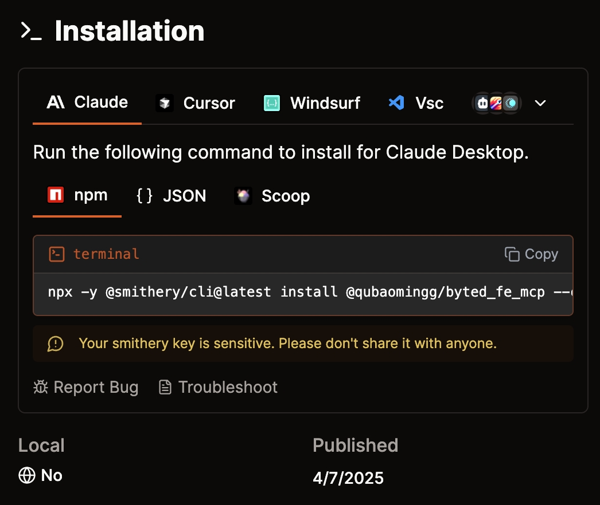

# byted_fe_mcp MCP Server

字节前端组件库文档服务，基于 Model Context Protocol 实现

## 使用 Useage
Smithery： [@qubaomingg/byted_fe_mcp](https://smithery.ai/server/@qubaomingg/byted_fe_mcp)



## 功能特性 Features

### 组件资源 Resource
- 通过 `component://` URI 访问组件文档
- 支持按组件库(okee/dprc/auxo)分类查看
- 提供组件基础信息和示例

### 工具方法 Tool
- `search_component` - 组件搜索
  - 参数:
    - `query`: string (必需) - 搜索关键词
    - `repo`: string (可选) - 指定组件库名称(okee/dprc/auxo)
  - 返回:
    - 匹配组件的详细信息，包括组件名称、示例链接等
    - 支持模糊匹配和关键词组合查询

- `search_components_multi` - 多关键词组件搜索
  - 参数:
    - `queries`: string[] (必需) - 多个搜索关键词数组
    - `repo`: string (可选) - 指定组件库名称
  - 返回:
    - 符合多个关键词条件的组件列表
    - 支持批量查询和结果聚合

- `list_library_components` - 列出指定组件库所有组件
  - 参数:
    - `library`: string (必需) - 组件库名称(okee/dprc/auxo)
  - 返回:
    - 该组件库下所有组件的完整列表
    - 每个组件包含名称、示例链接和基础描述

### 智能提示 Prompt
- 自动生成组件使用提示
- 支持自然语言查询组件用法
- 提供组件库整体介绍

## 开发指南

### 环境准备
```bash
npm install
npm run build
```

For development with auto-rebuild:
```bash
npm run watch
```

## 安装 Installation

To use with Claude Desktop, add the server config:

On MacOS: `~/Library/Application Support/Claude/claude_desktop_config.json`
On Windows: `%APPDATA%/Claude/claude_desktop_config.json`

```json
{
  "mcpServers": {
    "byted_fe_mcp": {
      "command": "node /path/to/byted_fe_mcp/build/index.js"
    }
  }
}
```

### 调试 Debugging

Since MCP servers communicate over stdio, debugging can be challenging. We recommend using the [MCP Inspector](https://github.com/modelcontextprotocol/inspector), which is available as a package script:

```bash
npm run inspector
```

The Inspector will provide a URL to access debugging tools in your browser.
